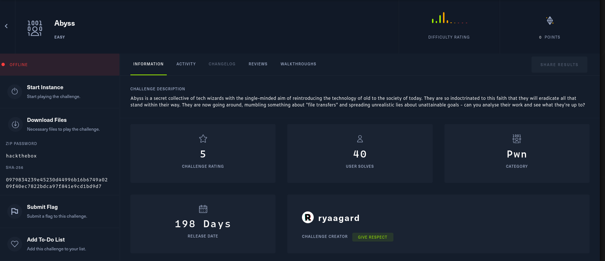

# Abyss

Class: pwn
Status: Done

Challenge

El reto contiene la siguiente información 

Lo siguiente es lo que contiene la carpeta challenge

El binario cuenta con las siguientes protecciones

Demos un vistazo a lo que cotiene el código fuente

Nos podemos dar cuenta que según el código fuente se trata de un simple login desde terminal, a primera vista  necesitamos obtener las credenciales para obtener la flag.

Para trabajar en el entorno local debemos lanzar nuestro dockerfile, pero primero le damos un vistazo para analizar su comportamiento

Podemos darnos cuenta de que hace una llamadas a /dev/urandom para la generación del archivo .creds, podriamos intentar un ataque de fuerza bruta, sin embargo, este sería con un tiempo prologando, ya que tanto el usuario como la contraseña son cadenas de 15 bytes. 

En el código fuente dentro de la función main tenemos lo siguiente 

Demos otro vistazo a la función cmd_login() 

Okay, la función espera recibir un formato ftp-type tanto como para usuario como para la contraseña (ej. USER some_username, PASS some_password) va a leer los comandos dentro de un buffer intermediario de un tamaño de 512, después copia el comando introducido para el usuario en una variable, la variable creada entra al buffer del stack con el mismo tamaño y después hace lo mismo con la parte de la contraseña. Debido a la instrucción strcopy(), se habrá copiado el contenido del buffer intermedio a los buffers del user y de la contraseña. Si logramos llenar los 512 bytes estaremos saliendo de los limites la variable buf y usuario. Si los buffers de user o pass se encuentran despues de del final del buffer podemos sobrescribir más allá del stack. 

Empezaremos desarrollando el script para hacer la explotación.  El script termina siendo el siguiente 

Ejecución

