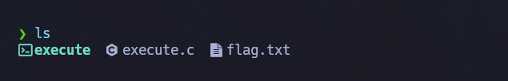

# Execute

Class: pwn
Status: Done

Al descomprimir el archivo obtenemos lo siguiente: 

Revisando el archivo flag.txt 

Revisando el archivo execute.c 

Revisando con file y checksec el ejecutable:

Y pasando el ejecutable por ghidra obtenemos la siguiente funciones :

Ahora lo paso por gdb para ver que hace en general

Vemos que en efecto ya que iVar1 no se cambia esta entra en la condición y sale del programa

Nota para script: Tomar en cuenta iVar1 para el shellcode (si, es que se trata de buffer overflow) y el filtro de bad characters en el archivo de c.

Primer versión del exploit: 

Al ejecutarlo podemos darnos cuenta del filtrado de carácteres, debemos encontrar la manera de poder saltar el filtrado y evitar los valores diferentes al /bin/sh que deseamos obtener

Nuevo shellcode: 

Después de varios intentos el shellcode queda de la siguiente manera 
- Se toma el valor  0x2a2a2a2a2a2a2a2a y usamos un XOR para transformar  0x2a2a2a2a2a2a2a2a en  0x68732f6e69622f (que es /bin/sh) 
- Se hace los movimientos para que obtengamos el valor del 58 ubicado en 0x3a 
- Después sumamos para obtener el registro 0x3b  que es el número 59 para poder ejecutar el syscall

Después de ensayo y error el script termina siendo el siguiente: 

Y al ejecutar nos da acceso a la shellcode, permitiendo encontrar la flag:

