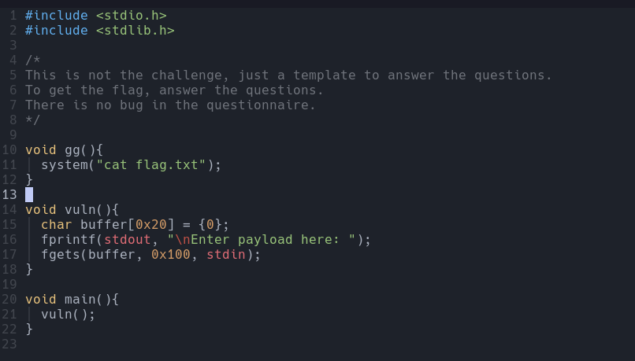

# Questionnaire

Class: pwn
Status: Done

Iniciamos con el código fuente que viene con el zip que contiene lo siguiente. 

El reto a simple vista podría verse como un ret2win, sin embargo al incluir la función fgets() esto hará que se convierta en un ret Por lo mientras veremos que hacer con el binario revisando su seguridad con la herramienta de checksec 

Ademas cuenta con NX enabled, lo que nos limita y se tratará de una ROP chain para alcanzar la función que deseamos (en este caso gg).