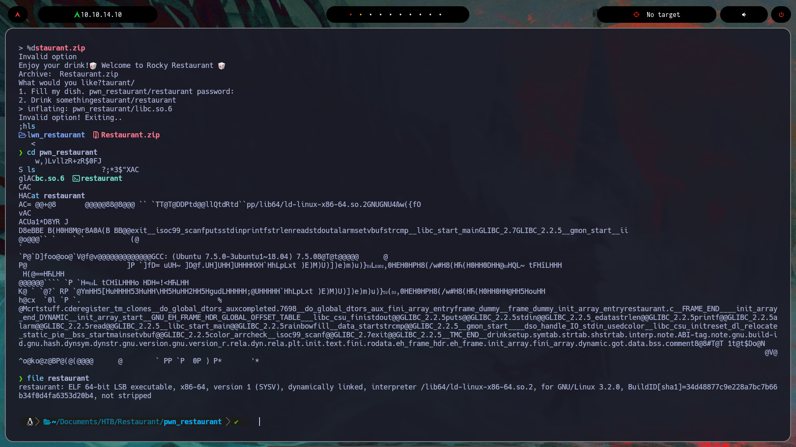

# Restaurant - HTB - pwn

Class: pwn
Status: Done



Usamos el comando pwn con el parámetro checksec y obtenemos lo siguiente:
 


Lo pasamos por ghidra y buscamos la función main para ver que hace el programa


Probamos con la opción 1 que nos lleva a la función fill(), que contiene lo siguiente:
(Notice we can leak the `libc runtime` address via the **puts** call. Also we can overflow the buffer of **local_28** variable to control the **RIP**. Let’s check the `drink()` function now.) 


Ahora anlizamos la función drink() 


Después la pasamos a gef para intentar hacer un desbordamiento en drink

Al parecer con un patron 100 bytes podría llegar al RIP


Al pasarle el patrón e inyectarlo en la función fill() 


Detuvo la operación en el ret, así que apuntaremos cerca de dicho


Indagando en los comandos de gef di con la forma para encontrar una variable capaz  con el siguiente valor, después di con la herramienta Ropper que sustituye a ROPgadget, ya que está sería capaz de encontrar más información. 


creamos el exploit y con el template de la herramienta de pwninit 

Ejecución del exploit 


Ahora podemos decir que cada instrucción es de 8 bytes, probaremos llenarlo mayor a 40

Dato: 
Al ejecutar el programa, nos damos cuenta que al hacer un salto, este ejecuta el brinco y finaliza


Ahora debemos modificar agregando la instrucción .recvuntil(b'\n') script para poder obtener la versión filtrada, la siguiente declaración nos ayudará. 

`leakedputsLibc = u64(sh.recvuntil(b'\n').strip().ljust(8, b'\x00'))`

Por lo siguiente se agrego las siguiente declaraciones: 


El output: 


Ahora apuntamos hacía la librería, aquí no hay tanto problema debido a que está se encontraba en el zip. 
Para encontrar la forma de atacar la librería, encontré la siguiente declaraciones 

```
libcBase = leakedputsLibc - libc.sym['puts']
info('libcBase: %#x', libcBase)

libc.address = libcBase
```

Nos servirá para apuntar correctamente nuestro payload 


Ahora que tenemos todos nuestro valores correctos agregamos los valores concretos para que se nos devuelva una shell


Obtenemos un shell 


