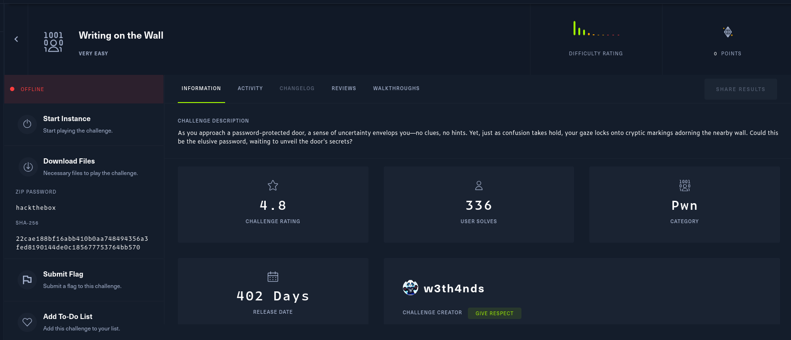

# Writing on the wall

Class: pwn
Status: Done



When we extract the content from the zip it gives us the next files


So we initialize with analyze the security and more info about our binary


Okay, our binary has all measures, so we need to test what it’s doing, so let’s check 


Okay let’s check with gef, and find what’s going on. 


Okay we will focus in two functions (main & open_door), let’s check what’s doing main 


In <+27> there are an important assign the value of 0x2073736170743377 is something like  ssapt3w (a little reminder we’re dealing with a little indian binary). then we have strcmp() function. 

> Note
> 
> 
> The strcmp() function compares the two strings s1 and s2. It returns an integer less than, equal
> to, or greater than zero if s1 is found, respectively, to be less than, to match, or be greater than s2.
> 

So, we need to strcmp return zero and then we’ll jump to open_door() function, let’s check how it works open_door()


It looks like only open a file and print the content and handle execeptions so our target is hit open_door()

## Vector of attack

- We could try pass the password w3tpass . But we could be in troubles if strcmp trunk our input cos’ we need to end with \x00 and in this case the format to read our input we need to added but only we have 7 bytes.
- We could try to overwrite the w3tpass.  if we could overwrite the first character by a null byte we could bypass the strcmp condition cos’ strcmp when finds a null bytes ends the read and return 0.

So, after a while trying to overwrite we got a easy answer and it’s fill the input null bytes (lol) I wrote a simple script for this task it looks like

```python
from pwn import *

p = process("./writing_on_the_wall")

payload = b'\x00\x00\x00\x00\x00\x00\x00'
p.recv()
p.sendline(payload)
p.interactive()
```

We execute and we obtain our local flag


We update our script and pwned this challenge

