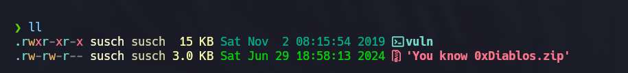

# You know 0xDiablos

Class: pwn
Status: Done

Al descomprimir nos damos cuenta que solo viene un ejecutable

Lo pasamos por ghidra y viene la función principal, la función vuln y la función flag 

La ejecución del programa usual es el siguiente: 

Verificamos la seguridad que tiene el archivo vuln con la herramienta checksec

Investigando un poco más me di cuenta que podría explotarse el no canary 

El ejecutar el file para obtener más información nos damos cuenta de que es un archivo de 32 bits 

Probamos con un patrón 1024 de gef 

Vemos que la ejecución se detuvo en el eip 0x62616177 ahora debemos buscar cuanto es necesario para llegar al eip 

Ahora sabemos que necesitamos agregar 188 bytes para el payload

Aquí podemos retomar la función flag 

Investigando podemos decir que podríamos usar el ret2win
Para un ataque ret2win se usa la siguiente formula
padding + flagAddr + returnAddress + param1 + param2

param1: 0xdeadbeef

param2: 0xc0ded00d

Creamos un script: 
para explotarlo 

EL output: 

